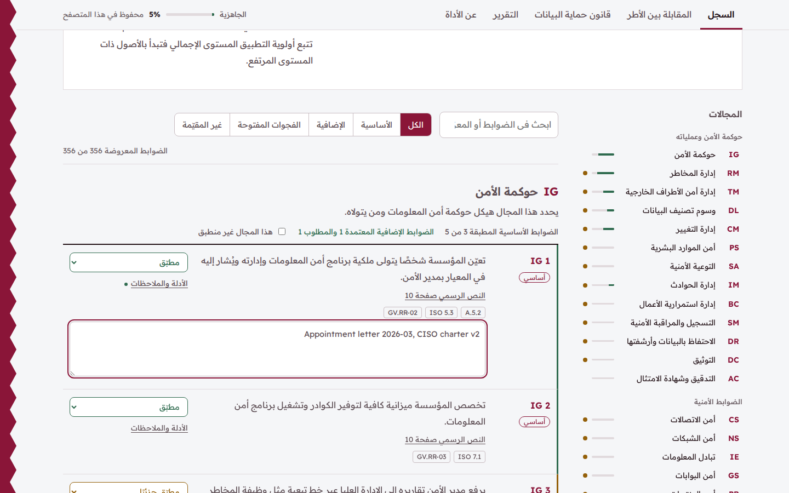
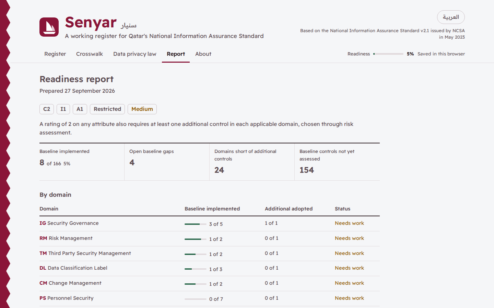

# Senyar

A working register for Qatar's **National Information Assurance Standard v2.1** (NIA), issued by the National Cyber Security Agency (NCSA). Rate a scope, work through all 356 controls, see what the Standard requires at your classification, and export a Statement of Applicability. It includes a crosswalk to ISO/IEC 27001:2022 and NIST CSF 2.0, the Personal Data Privacy Protection Law obligations that sit beside the Standard, and an MCP server so AI agents can use the same data.

Site: https://senyar.3li.info

Arabic follows below. [بالعربية](#بالعربية)



## What it does

- **Rates the scope.** Confidentiality, integrity and availability ratings give the confidentiality label, the aggregate level from the National Data Classification Policy, and what the Standard requires.
- **Walks the register.** All 356 control statements across 26 domains, each with an English and Arabic summary, its baseline mark, any classification condition in the text, and a link to its page in NCSA's PDF. You record status, adoption of additional controls, and evidence.
- **Reports readiness.** Baseline progress, additional controls per domain, time-bound duties such as reporting critical incidents to NCSA within two hours, and a prioritized gap list.
- **Exports.** Statement of Applicability as Excel (Arabic sheets open right to left), a printable report, and an assessment file you can save and reopen.
- **Crosswalks.** Every control mapped to ISO/IEC 27001:2022 clauses and Annex A controls and to NIST CSF 2.0 subcategories, searchable in both directions.
- **Covers the PDPPL.** 22 obligations from Law No. 13 of 2016 with their articles, penalty tier and related NIA controls.

Everything runs in the browser. There is no server, no account and no tracking, and the assessment never leaves the device unless you export it.



## How the requirements are worked out

The Standard (section 2.3) builds on the National Data Classification Policy:

| Highest rating | What the Standard requires |
| --- | --- |
| 0 on all three | No baseline controls; some minimal controls may apply |
| 1 | Every baseline control (marked with an asterisk in the official text) |
| 2 | Baseline, plus at least one additional control in each applicable domain, chosen by risk assessment |
| 3 or higher | Baseline, plus at least two additional controls in each applicable domain |

The aggregate level (Low, Medium, High) comes from the policy's matrix and sets implementation priority. The matrix stops at C3, so C4 is read on the C3 row. Where a domain has fewer additional controls than the rule asks for, the requirement is capped at what exists (Audit and Certification has none).

## Sources and provenance

| Source | Used for |
| --- | --- |
| NIA Standard v2.1, NCSA, May 2023 | Control IDs, baseline marks, structure, page numbers |
| National Data Classification Policy v3.0, NCSA | Labels, aggregate matrix, Arabic terms |
| Law No. 13 of 2016 (PDPPL), English text published by NCSA | Obligations and penalties |
| PDPPL-02050217E, NCSA breach notification guideline | The 72 hour window |
| NIST CSF 2.0 (CSWP 29) | Subcategory outcomes |
| ISO/IEC 27001:2022 | Clause and control numbers and titles |

The repository does not copy NCSA's wording. Summaries, the crosswalk and the notes are this project's own work and are kept apart from the official text. `tools/verify_nia_source.py` rebuilds the control structure from the official PDF and compares it with `data/src/nia-structure.tsv`.

The official text has a few slips that the tool flags rather than hides, among them PH 2 printed twice, CS 1 repeating CS 7, MS 9 and MS 17 being identical, and AM 17 missing the word "not". The About tab lists them all.

## MCP server

The server has no dependencies and works offline.

```sh
npx -y github:SiteQ8/Senyar
```

Add it to any MCP client:

```json
{
  "mcpServers": {
    "senyar": { "command": "npx", "args": ["-y", "github:SiteQ8/Senyar"] }
  }
}
```

From a clone, `node mcp/server.mjs` does the same.

| Tool | What it returns |
| --- | --- |
| `nia_list_domains` | The 26 domains with baseline and additional counts |
| `nia_get_control` | One control: summary, conditions, official page, mappings, PDPPL links, source notes |
| `nia_search_controls` | Controls matching words in English or Arabic, by domain or baseline mark |
| `nia_classify` | Label, aggregate level and requirement for C, I and A ratings |
| `nia_applicable_controls` | Per domain requirements and the controls that apply to a scope |
| `nia_crosswalk` | NIA to ISO/IEC 27001:2022 and NIST CSF 2.0, or the reverse |
| `nia_pdppl_obligations` | PDPPL obligations by article or keyword |
| `nia_gap_report` | Readiness and prioritized gaps for an assessment saved by the site |

Every tool is read-only, takes `lang` (`en` or `ar`) and `response_format` (`markdown` or `json`), and returns structured content alongside text.

## Assessment file

The site saves assessments as JSON, and `nia_gap_report` reads the same format:

```json
{
  "schema": "nia-assessment/1",
  "ratings": { "C": 2, "I": 1, "A": 1 },
  "domains": { "VL": { "na": true, "note": "No virtualization in scope" } },
  "controls": { "IM 8": { "status": "implemented", "note": "Runbook section 4" }, "IG 5": { "adopted": true, "status": "partial" } }
}
```

Statuses are `implemented`, `partial`, `missing` and `na`.

## Development

```sh
npm test            # data and Arabic writing rules, core logic, XLSX, MCP protocol, site checks
npm run build       # rebuild docs/data/bundle.json from data/src
npm run preflight   # the tests plus release checks
python3 tools/verify_nia_source.py path/to/NIA_Standard_En_V2.1.pdf
```

No dependencies; Node 18 or later. `data/src` holds the source data, `docs` is the site, `mcp` the server, `scripts` the build and release checks, and `test` the suite. The tests enforce that every summary exists in both languages, that Arabic text closes each sentence with a single period and joins clauses with connectives, that every number survives translation, and that the page loads nothing from other sites.

## The name

Senyar (سنيار) is a word from the Gulf's maritime heritage, still alive in Qatar, for boats setting out to sea together. Meeting the Standard is a voyage every organisation in Qatar makes, and this register is open so they can make it together.

## Licence

The code, summaries, crosswalk and notes are released under the MIT licence. The NIA Standard belongs to NCSA, which this project acknowledges as its source and owner; the project is not affiliated with or endorsed by NCSA. See [NOTICE.md](NOTICE.md).

## بالعربية

**سنيار** سجل عمل تفاعلي مفتوح المصدر لمعيار تأمين المعلومات الوطنية الإصدار 2.1 الصادر عن الوكالة الوطنية للأمن السيبراني في دولة قطر ويضم مقابلة مع ISO/IEC 27001:2022 وNIST CSF 2.0 والتزامات قانون حماية خصوصية البيانات الشخصية وخادم MCP لوكلاء الذكاء الاصطناعي.

### ماذا تقدم الأداة

- تصنّف النطاق وفق السرية والنزاهة والتوفر فتعرض وسم السرية والمستوى الإجمالي وما يتطلبه المعيار من ضوابط أساسية وإضافية.
- تعرض الضوابط كلها وعددها 356 بملخصات عربية وإنجليزية وشروط الانطباق ورابط الصفحة الرسمية ثم تحفظ حالة كل ضابط والأدلة عليه.
- تُعد تقرير الجاهزية وقائمة الفجوات حسب الأولوية وتصدّر بيان قابلية التطبيق بصيغة Excel وتطبع التقرير وتحفظ ملف التقييم وتفتحه.
- تقابل ضوابط المعيار مع ISO/IEC 27001:2022 وNIST CSF 2.0 في الاتجاهين.
- تلخص 22 التزامًا من القانون رقم (13) لسنة 2016 مع المواد والغرامات والضوابط ذات الصلة.
- تعمل كلها داخل المتصفح فلا يُرسل التقييم إلى أي جهة ولا توجد حسابات أو تتبع.

### كيف تُحسب المتطلبات

تستخدم الأداة مصفوفة سياسة تصنيف البيانات الوطنية لحساب المستوى الإجمالي ثم تطبق قواعد القسم 2.3 من المعيار فلا تتطلب الأصول المصنفة 0 في المحددات الثلاثة ضوابط أساسية بينما يتطلب المستوى 1 جميع الضوابط الأساسية ويضيف المستوى 2 ضابطًا إضافيًا واحدًا على الأقل في كل مجال منطبق ويضيف المستوى 3 فأعلى ضابطين إضافيين على الأقل.

### المصادر

تملك الوكالة الوطنية للأمن السيبراني المعيار وسياسة التصنيف ولا ينقل هذا المستودع نصوصهما بل يعتمد على معرّفات الضوابط وعلامات الضوابط الأساسية وأرقام الصفحات أما الملخصات والمقابلات والملاحظات فهي عمل خاص بالمشروع. ويعيد السكربت `tools/verify_nia_source.py` بناء هيكل الضوابط من ملف PDF الرسمي ويقارنه بالبيانات.

### خادم MCP

يعمل الخادم دون أي اعتماديات ويمكن إضافته إلى أي عميل يدعم MCP عبر الأمر `npx -y github:SiteQ8/Senyar` كما في المثال أعلاه.

- `nia_list_domains` يعرض المجالات الستة والعشرين وعدد ضوابطها.
- `nia_get_control` يعرض ضابطًا واحدًا بملخصه وشروطه وصفحته الرسمية ومقابلاته.
- `nia_search_controls` يبحث في الملخصات العربية والإنجليزية والمعرّفات.
- `nia_classify` يحوّل التصنيف إلى وسم ومستوى إجمالي ومتطلبات.
- `nia_applicable_controls` يعرض الضوابط المنطبقة على نطاق معين.
- `nia_crosswalk` يقابل بين المعيار وISO/IEC 27001:2022 وNIST CSF 2.0.
- `nia_pdppl_obligations` يعرض التزامات قانون حماية خصوصية البيانات الشخصية.
- `nia_gap_report` يحلل ملف تقييم محفوظًا من الموقع ويعرض الفجوات.

### الاسم

سنيار كلمة من التراث البحري في الخليج ما زالت حاضرة في قطر وتعني خروج السفن إلى البحر معًا وكذلك فإن الامتثال للمعيار رحلة تخوضها كل جهة في قطر لذا جاء هذا السجل مفتوحًا لتخوضها الجهات معًا.

### الترخيص

الشفرة والملخصات والمقابلات متاحة بترخيص MIT بينما يبقى معيار تأمين المعلومات الوطنية ملكًا للوكالة الوطنية للأمن السيبراني ولا ترتبط هذه الأداة بالوكالة ولا تحظى باعتمادها.
